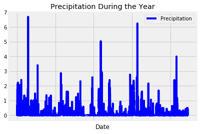
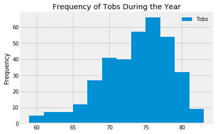
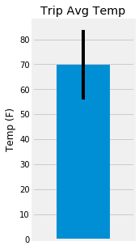
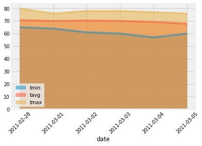

# Climate Analysis

In this project, Python and SQLAlchemy were used to analyze the climate in Hawaii in order to plan a long holiday vacation in Honolulu, Hawaii.  A Flask API 
was created based on the queries used for climate analysis and data exploration of the climate database.


## Jupyter Notebook Code

```python
%matplotlib inline
from matplotlib import style
style.use('fivethirtyeight')
import matplotlib.pyplot as plt
```


```python
import numpy as np
import pandas as pd
```


```python
import datetime as dt
from datetime import timedelta, date
```

# Reflect Tables into SQLAlchemy ORM


```python
# Python SQL toolkit and Object Relational Mapper
import sqlalchemy
from sqlalchemy.ext.automap import automap_base
from sqlalchemy.orm import Session
from sqlalchemy import create_engine, func, inspect
```


```python
engine = create_engine("sqlite:///Resources/hawaii.sqlite")
```


```python
# Reflect an existing database into a new model
Base = automap_base()

# Reflect the tables
Base.prepare(engine, reflect=True)
```


```python
# View all of the classes that automap found
Base.classes.keys()
```


    ['measurement', 'station']


```python
# Save references to each table
Measurement = Base.classes.measurement
Station = Base.classes.station
```


```python
# Create session (link) from Python to the DB
session = Session(engine)
```


```python
# Create inspector
inspector = inspect(engine)

# Inspect the measurement table
columns_measurement = inspector.get_columns('measurement')
for c in columns_measurement:
    print(c['name'], c["type"])
```

    id INTEGER
    station TEXT
    date TEXT
    prcp FLOAT
    tobs FLOAT
    


```python
# Inspect the station table
columns_station = inspector.get_columns('station')
for c in columns_station:
    print(c['name'], c["type"])
```

    id INTEGER
    station TEXT
    name TEXT
    latitude FLOAT
    longitude FLOAT
    elevation FLOAT
    

# Exploratory Climate Analysis


```python
# Design a query to retrieve the last 12 months of precipitation data and plot the results

# Calculate the date 1 year ago from the last data point in the database
recent_date_query = session.query(Measurement.date).order_by(Measurement.date.desc()).first()
recent_date_list = list(np.ravel(recent_date_query))
recent_date = dt.datetime.strptime(recent_date_list[0], "%Y-%m-%d").date()

year_ago = recent_date - dt.timedelta(days=365)

# Perform a query to retrieve the data and precipitation scores
last_12_months_precipitation = session.query(Measurement.date, Measurement.prcp).filter(Measurement.date >= year_ago).\
    filter(Measurement.date <= recent_date).\
    order_by(Measurement.date.desc()).all()

# Save the query results as a Pandas DataFrame and set the index to the date column
precipitation_df = pd.DataFrame(last_12_months_precipitation, columns=['Date', 'Precipitation']).set_index('Date')

# Sort the dataframe by date
precipitation_df = precipitation_df.sort_values(by=['Date'])

# Use Pandas Plotting with Matplotlib to plot the data
precipitation_df.plot(color="blue")
plt.title("Precipitation During the Year")
plt.show()
```





```python
# Use Pandas to calculate the summary statistics for the precipitation data
precipitation_df.describe()
```


<div>
<style scoped>
    .dataframe tbody tr th:only-of-type {
        vertical-align: middle;
    }

    .dataframe tbody tr th {
        vertical-align: top;
    }

    .dataframe thead th {
        text-align: right;
    }
</style>
<table border="1" class="dataframe">
  <thead>
    <tr style="text-align: right;">
      <th></th>
      <th>Precipitation</th>
    </tr>
  </thead>
  <tbody>
    <tr>
      <th>count</th>
      <td>2021.000000</td>
    </tr>
    <tr>
      <th>mean</th>
      <td>0.177279</td>
    </tr>
    <tr>
      <th>std</th>
      <td>0.461190</td>
    </tr>
    <tr>
      <th>min</th>
      <td>0.000000</td>
    </tr>
    <tr>
      <th>25%</th>
      <td>0.000000</td>
    </tr>
    <tr>
      <th>50%</th>
      <td>0.020000</td>
    </tr>
    <tr>
      <th>75%</th>
      <td>0.130000</td>
    </tr>
    <tr>
      <th>max</th>
      <td>6.700000</td>
    </tr>
  </tbody>
</table>
</div>


```python
# Design a query to show how many stations are available in this dataset
session.query(Measurement.station).distinct().count()
```


    9


```python
# Figure out the most active stations (stations have the most rows)
# List the stations and the counts in descending order
session.query(Measurement.station, func.count(Measurement.station)).\
    group_by(Measurement.station).\
    order_by(func.count(Measurement.station).desc()).all()
```


    [('USC00519281', 2772),
     ('USC00519397', 2724),
     ('USC00513117', 2709),
     ('USC00519523', 2669),
     ('USC00516128', 2612),
     ('USC00514830', 2202),
     ('USC00511918', 1979),
     ('USC00517948', 1372),
     ('USC00518838', 511)]


```python
# Get the most active station
top_station_query = session.query(Measurement.station).\
    group_by(Measurement.station).\
    order_by(func.count(Measurement.station).desc()).first()

top_station = top_station_query[0]
top_station
```


    'USC00519281'


```python
# Using the station id from the previous query, calculate the lowest temperature recorded,
# highest temperature recorded, and average temperature for the most active station
top_station_stats_query = session.query(func.min(Measurement.tobs), func.max(Measurement.tobs), func.avg(Measurement.tobs)).\
    filter(Measurement.station == top_station)

top_station_stats = top_station_stats_query[0]
top_station_stats
```


    (54.0, 85.0, 71.66378066378067)


```python
# Choose the station with the highest number of temperature observations
most_tobs_station_query = session.query(Measurement.station).\
    group_by(Measurement.station).\
    order_by(func.count(Measurement.tobs).desc()).first()

most_tobs_station = most_tobs_station_query[0]

# Query the last 12 months of temperature observation data for this station
tobs_recent_date_query = session.query(Measurement.date).order_by(Measurement.date.desc()).\
    filter(Measurement.station == most_tobs_station).first()

tobs_recent_date_list = list(np.ravel(tobs_recent_date_query))
tobs_recent_date = dt.datetime.strptime(tobs_recent_date_list[0], "%Y-%m-%d").date()

tobs_year_ago = tobs_recent_date - dt.timedelta(days=365)

# Perform a query to retrieve the data and tobs scores
last_12_months_tobs = session.query(Measurement.date, Measurement.tobs).\
     filter(Measurement.date >= tobs_year_ago).\
     filter(Measurement.date <= tobs_recent_date).\
     filter(Measurement.station == most_tobs_station).\
     order_by(Measurement.date.desc()).all()

# Save the query results as a Pandas DataFrame and set the index to the date column
tobs_df = pd.DataFrame(last_12_months_tobs, columns=['Date', 'Tobs']).set_index('Date')

# Sort the dataframe by date
tobs_df = tobs_df.sort_values(by=['Date'])

# Plot the results as a histogram
fig, ax = plt.subplots()

ax.set_title("Frequency of Tobs During the Year")
ax.set_ylabel("Frequency")

x_values = tobs_df["Tobs"]
num_bins = 12

ax.hist(x_values, bins=num_bins)
ax.legend()
plt.show()
```





```python
# This function called `calc_temps` will accept start date and end date in the format '%Y-%m-%d' 
# and return the minimum, average, and maximum temperatures for that range of dates
def calc_temps(start_date, end_date):
    """TMIN, TAVG, and TMAX for a list of dates.
    
    Args:
        start_date (string): A date string in the format %Y-%m-%d
        end_date (string): A date string in the format %Y-%m-%d
        
    Returns:
        TMIN, TAVE, and TMAX
    """
    
    return session.query(func.min(Measurement.tobs), func.avg(Measurement.tobs), func.max(Measurement.tobs)).\
        filter(Measurement.date >= start_date).filter(Measurement.date <= end_date).all()

# function usage example
print(calc_temps('2012-02-28', '2012-03-05'))
```

    [(62.0, 69.57142857142857, 74.0)]
    


```python
# Use your previous function `calc_temps` to calculate the tmin, tavg, and tmax 
# for your trip using the previous year's data for those same dates.
trip_dates_temps = calc_temps('2011-02-28', '2011-03-05')
trip_dates_temps
```


    [(61.0, 69.75510204081633, 75.0)]


```python
# Plot the results from your previous query as a bar chart
# Use "Trip Avg Temp" as the Title
# Use the average temperature for the y value
# Use the peak-to-peak (tmax-tmin) value as the y error bar (yerr)
trip_dates_temps_df = pd.DataFrame(trip_dates_temps, columns=['tmin', 'tave', 'tmax'])

y_errbar = trip_dates_temps_df['tmax'] - trip_dates_temps_df['tmin']

fig, ax = plt.subplots(figsize=(2,5))
ax.set_title("Trip Avg Temp")
ax.set_ylabel("Temp (F)")
ax.bar(0, trip_dates_temps_df['tave'], yerr = y_errbar)
ax.set_xlim(-0.75, 0.75)
ax.set_xticks([])
ax.grid(axis="x")
plt.show()
```





```python
# Calculate the rainfall per weather station for your trip dates using the previous year's matching dates
# Sort this in descending order by precipitation amount and list the station, name, latitude, longitude, and elevation
sel = [Measurement.station, Station.name, Station.latitude, Station.longitude, Station.elevation, func.sum(Measurement.prcp)]
trip_dates_precipitation = session.query(*sel).filter(Measurement.station == Station.station).\
    filter(Measurement.date >= '2011-02-28').\
    filter(Measurement.date <= '2011-03-05').\
    group_by(Measurement.station).\
    order_by(func.sum(Measurement.prcp).desc()).all()

trip_dates_precipitation
```


    [('USC00518838',
      'UPPER WAHIAWA 874.3, HI US',
      21.4992,
      -158.0111,
      306.6,
      2.33),
     ('USC00519281',
      'WAIHEE 837.5, HI US',
      21.45167,
      -157.84888999999998,
      32.9,
      2.23),
     ('USC00519523',
      'WAIMANALO EXPERIMENTAL FARM, HI US',
      21.33556,
      -157.71139,
      19.5,
      2.19),
     ('USC00514830',
      'KUALOA RANCH HEADQUARTERS 886.9, HI US',
      21.5213,
      -157.8374,
      7.0,
      1.96),
     ('USC00516128',
      'MANOA LYON ARBO 785.2, HI US',
      21.3331,
      -157.8025,
      152.4,
      1.45),
     ('USC00513117', 'KANEOHE 838.1, HI US', 21.4234, -157.8015, 14.6, 1.44),
     ('USC00519397', 'WAIKIKI 717.2, HI US', 21.2716, -157.8168, 3.0, 1.38),
     ('USC00511918',
      'HONOLULU OBSERVATORY 702.2, HI US',
      21.3152,
      -157.9992,
      0.9,
      0.63),
     ('USC00517948', 'PEARL CITY, HI US', 21.3934, -157.9751, 11.9, None)]


# Daily Normals


```python
# Create a query that will calculate the daily normals 
# (i.e. the averages for tmin, tmax, and tavg for all historic data matching a specific month and day)

def daily_normals(date):
    """Daily Normals.
    
    Args:
        date (str): A date string in the format '%m-%d'
        
    Returns:
        A list of tuples containing the daily normals, tmin, tavg, and tmax
    
    """
    
    sel = [func.min(Measurement.tobs), func.avg(Measurement.tobs), func.max(Measurement.tobs)]
    return session.query(*sel).filter(func.strftime("%m-%d", Measurement.date) == date).all()
    
daily_normals("01-01")
```


    [(62.0, 69.15384615384616, 77.0)]


```python
# Calculate the daily normals for your trip

# Push each tuple of calculations into a list called `normals`
normals = []

# Create list for range of dates for %m-%d format
datelist = []

# Create list for range of dates for %Y-%m-%d format
fulldatelist = []

# Function to get range of dates using start date and end date
def date_range(date1, date2):
      
    days_difference = date2 - date1
    date_range_list = [date1 + timedelta(i) for i in range(days_difference.days + 1)]
    return date_range_list
    
# Set the start date (2011-02-28) and end date (2011-03-05) of the trip 
trip_start_date = date(2011, 2, 28)
trip_end_date = date(2011, 3, 5)

# Use the start and end date to create a range of dates. Strip off the year and save a list of %m-%d strings
for tripdate in date_range(trip_start_date, trip_end_date):
    datelist.append(tripdate.strftime("%m-%d"))

# Save a list of %Y-%m-%d strings for the x-axis in the area plot
for tripdate in date_range(trip_start_date, trip_end_date):
    fulldatelist.append(tripdate.strftime("%Y-%m-%d"))

# Loop through the list of %m-%d strings and calculate the normals for each date
for tripdate in datelist:
    normal_calc = daily_normals(tripdate)
    for record in normal_calc:
        normals.append(record)

normals
```


    [(65.0, 70.65517241379311, 80.0),
     (64.0, 70.0327868852459, 76.0),
     (61.0, 70.36666666666666, 78.0),
     (60.0, 70.06896551724138, 78.0),
     (57.0, 69.27272727272727, 77.0),
     (60.0, 67.89090909090909, 76.0)]


```python
# Load the previous query results into a Pandas DataFrame and add the `trip_dates` range as the `date` index
trip_prcp_df = pd.DataFrame(normals, columns=['tmin','tavg', 'tmax'])
trip_prcp_df['date'] = fulldatelist
trip_prcp_df.set_index('date', inplace=True)
trip_prcp_df
```


<div>
<style scoped>
    .dataframe tbody tr th:only-of-type {
        vertical-align: middle;
    }

    .dataframe tbody tr th {
        vertical-align: top;
    }

    .dataframe thead th {
        text-align: right;
    }
</style>
<table border="1" class="dataframe">
  <thead>
    <tr style="text-align: right;">
      <th></th>
      <th>tmin</th>
      <th>tavg</th>
      <th>tmax</th>
    </tr>
    <tr>
      <th>date</th>
      <th></th>
      <th></th>
      <th></th>
    </tr>
  </thead>
  <tbody>
    <tr>
      <th>2011-02-28</th>
      <td>65.0</td>
      <td>70.655172</td>
      <td>80.0</td>
    </tr>
    <tr>
      <th>2011-03-01</th>
      <td>64.0</td>
      <td>70.032787</td>
      <td>76.0</td>
    </tr>
    <tr>
      <th>2011-03-02</th>
      <td>61.0</td>
      <td>70.366667</td>
      <td>78.0</td>
    </tr>
    <tr>
      <th>2011-03-03</th>
      <td>60.0</td>
      <td>70.068966</td>
      <td>78.0</td>
    </tr>
    <tr>
      <th>2011-03-04</th>
      <td>57.0</td>
      <td>69.272727</td>
      <td>77.0</td>
    </tr>
    <tr>
      <th>2011-03-05</th>
      <td>60.0</td>
      <td>67.890909</td>
      <td>76.0</td>
    </tr>
  </tbody>
</table>
</div>


```python
# Plot the daily normals as an area plot with `stacked=False`
x_ticks_dates = trip_prcp_df.index.tolist()

trip_prcp_df.plot(kind="area", stacked=False, rot=45)
plt.xticks(range(len(x_ticks_dates)), x_ticks_dates)
plt.show()
```





## Flask API Python Code

```python

import numpy as np
import datetime as dt

import sqlalchemy
from sqlalchemy.ext.automap import automap_base
from sqlalchemy.orm import Session
from sqlalchemy import create_engine, func

from flask import Flask, jsonify


#################################################
# Database Setup
#################################################
engine = create_engine("sqlite:///Resources/hawaii.sqlite", connect_args={'check_same_thread': False})

# Reflect an existing database into a new model
Base = automap_base()
# Reflect the tables
Base.prepare(engine, reflect=True)

# Save references to the tables
Measurement = Base.classes.measurement
Station = Base.classes.station

# Create our session (link) from Python to the DB
session = Session(engine)


#################################################
# Date List Setup
#################################################

# Setup a list of dates for user date searches
date_results = session.query(Measurement.date).distinct().all()
dates_list = [record_date.date for record_date in date_results]


#################################################
# Flask Setup
#################################################
app = Flask(__name__)


#################################################
# Flask Routes
#################################################

@app.route("/")
def welcome():
    """List all available api routes."""
    return (
        f"Available Routes:<br/>"
        f"<br/>"
        f"---Check the precipitation for all dates in the database---<br/>"
        f"/api/v1.0/precipitation<br/>"
        f"<br/>"
        f"---Check the information about all the stations---<br/>"
        f"/api/v1.0/stations<br/>"
        f"<br/>"
        f"---Check the temperature observations from a year from the last data point---<br/>"
        f"/api/v1.0/tobs<br/>"
        f"<br/>"
        f"---Get the minimum temperature, the average temperature, and the max temperature dates ranging from a given start date to the most recent date data point---<br/>"
        f"---Input start_date (format: YYYY/MM/DD) for variable 'start' after /api/v1.0/---<br/>"
        f"/api/v1.0/start<br/>" 
        f"<br/>"
        f"---Get the minimum temperature, the average temperature, and the max temperature for a given start-end range---<br/>"
        f"---Input start_date/end_date (format: YYYY/MM/DD) for variables 'start' and 'end' after /api/v1.0/---<br/>"
        f"/api/v1.0/start/end"
    )


@app.route("/api/v1.0/precipitation")
def precipitation():
 
    """Convert the query results to a Dictionary using `date` as the key and `prcp` as the value."""
    # Query date and precipitation
    results = session.query(Measurement.date, Measurement.prcp).all()
    
    # Create a dictionary from the row data and append to a list of all_precipitation
    all_precipitation = []
    for precipitation in results:
        precipitation_dict = {}
        precipitation_dict[precipitation.date] = precipitation.prcp
        all_precipitation.append(precipitation_dict)

    # Return precipitation information for dates
    return jsonify(all_precipitation)


@app.route("/api/v1.0/stations")
def stations():
    """Return a JSON list of stations from the dataset."""
    # Query all stations
    results = session.query(Station).all()

    # Create a dictionary from the row data and append to a list of all_stations
    all_stations = []
    for station in results:
        station_dict = {}
        station_dict["station"] = station.station
        station_dict["latitude"] = station.latitude
        station_dict["longitude"] = station.longitude
        station_dict["elevation"] = station.elevation
        all_stations.append(station_dict)

    # Return information for all stations
    return jsonify(all_stations)


@app.route("/api/v1.0/tobs")
def tobs():
    """Query for the dates and temperature observations from a year from the last data point."""
    # Get date from last data point
    tobs_recent_date_query = session.query(Measurement.date).order_by(Measurement.date.desc()).first()
    tobs_recent_date_list = list(np.ravel(tobs_recent_date_query))
    tobs_recent_date = dt.datetime.strptime(tobs_recent_date_list[0], "%Y-%m-%d").date()

    # Get date from a year from the last data point date
    tobs_year_ago = tobs_recent_date - dt.timedelta(days=365)

    # Query dates and temperature observations from a year from the last data point
    results = session.query(Measurement.date, Measurement.tobs).\
        filter(Measurement.date >= tobs_year_ago).\
        filter(Measurement.date <= tobs_recent_date).\
        order_by(Measurement.date.desc()).all()

    # Create a dictionary from the row data and append to a list of all_tobs
    all_tobs = []
    for tobs in results:
        tobs_dict = {}
        tobs_dict["date"] = tobs.date
        tobs_dict["tobs"] = tobs.tobs
        all_tobs.append(tobs_dict)
    
    # Return dates and temperature observations
    return jsonify(all_tobs)


@app.route("/api/v1.0/<start>")
def tempstats_start(start):
    '''Return a JSON list of the minimum temperature, the average temperature, and the max temperature for dates ranging from a given start date
        to the most recent date data point, or a 404 if the given start date is not found'''

    if start in dates_list: 

        # Query minimum temperature, the average temperature, and the max temperature for dates ranging from a given start date
        # to the most recent date data point
        sel = [Measurement.date, 
            func.min(Measurement.tobs).label("TMIN"),
            func.avg(Measurement.tobs).label("TAVG"),
            func.max(Measurement.tobs).label("TMAX")]
        results = session.query(*sel).filter(Measurement.date >= start).group_by(Measurement.date).all()
        
        # Create a dictionary from the row data and append to a list of all_temp_stats
        all_temp_stats = []
        for temp_stats in results:
            temp_stats_dict = {}
            temp_stats_dict["date"] = temp_stats.date
            temp_stats_dict["TMIN"] = temp_stats.TMIN
            temp_stats_dict["TAVG"] = temp_stats.TAVG
            temp_stats_dict["TMAX"] = temp_stats.TMAX
            all_temp_stats.append(temp_stats_dict)
    
        # Return dates and temperature stats
        return jsonify(all_temp_stats)

    else:
        return jsonify({"error": f"Date with start_date {start} not found. Date format must be YYYY-MM-DD."}), 404


@app.route("/api/v1.0/<start>/<end>")
def tempstats_start_end(start, end):
    '''Return a JSON list of the minimum temperature, the average temperature, and the max temperature for a given start-end range.'''

    if start in dates_list and end in dates_list: 

        # Query minimum temperature, the average temperature, and the max temperature for a given start-end range
        sel = [Measurement.date, 
            func.min(Measurement.tobs).label("TMIN"),
            func.avg(Measurement.tobs).label("TAVG"),
            func.max(Measurement.tobs).label("TMAX")]
        results = session.query(*sel).filter(Measurement.date >= start).filter(Measurement.date <= end).group_by(Measurement.date).all()
        
        # Create a dictionary from the row data and append to a list of all_temp_stats
        all_temp_stats = []
        for temp_stats in results:
            temp_stats_dict = {}
            temp_stats_dict["date"] = temp_stats.date
            temp_stats_dict["TMIN"] = temp_stats.TMIN
            temp_stats_dict["TAVG"] = temp_stats.TAVG
            temp_stats_dict["TMAX"] = temp_stats.TMAX
            all_temp_stats.append(temp_stats_dict)
    
        # Return dates and temperature stats
        return jsonify(all_temp_stats)

    elif start not in dates_list and end in dates_list:

        # Return error message if start date is not found
        return jsonify({"error": f"Date with start_date {start} not found. Date format must be YYYY-MM-DD."}), 404

    elif start in dates_list and end not in dates_list:

        # Return error message if end date is not found
        return jsonify({"error": f"Date with end_date {end} not found. Date format must be YYYY-MM-DD."}), 404

    else:

        # Return error message if start date and end date are not found
        return jsonify({"error": f"Date with start_date {start} and end_date {end} not found. Date format must be YYYY-MM-DD."}), 404


if __name__ == '__main__':
    app.run(debug=True)

```